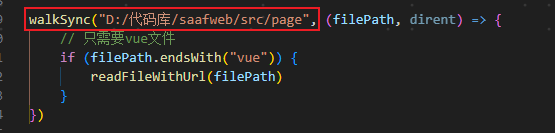
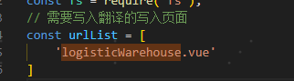

# i18n

## Project setup
```
npm install
```
### usage

**1.修改script.js文件中文件地址，并清除out.csv中除title以外的数据**

```
node script
```
**2.如果有业务提供的翻译，将在线翻译转为csv文件然后替换掉IBU.csv,如果业务提供的翻译中有英文','，需手动替换','为'^*^'**
```
node csvDiff
```
**3.修改你需要写入翻译的页面**

```
node reWrite
```